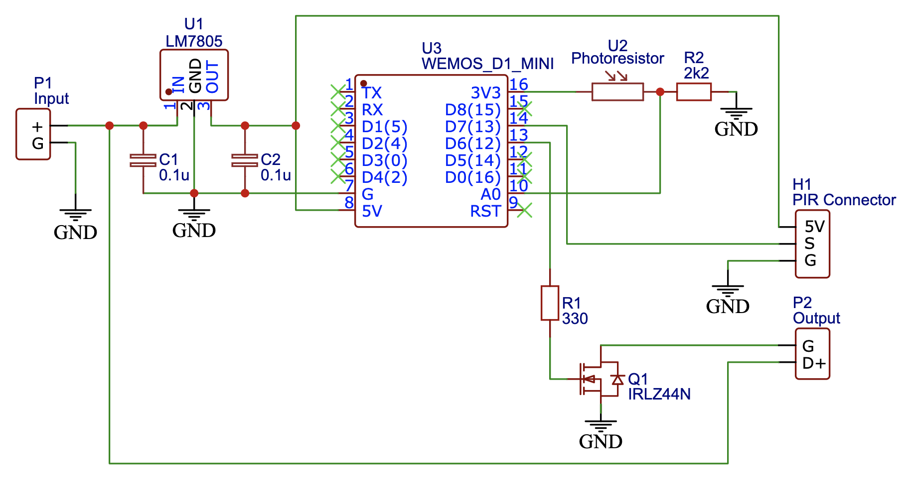
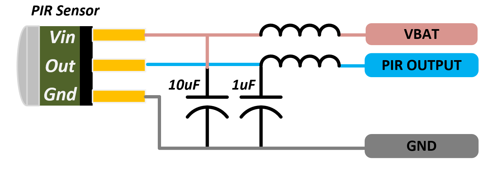

# WiFi enabled bed light

LED light triggered by PIR motion sensor and connected to Alexa using ESP8266.
Original purpose is the night light under the bed, but the usage is actually universal.

## Circuit Diagram

## Remote console

When the module is connected to WiFi, there is a remote console available at the
http://\<Device IP\>/webserial url. The list of possible commands is provided when the `help`
command is sent there.

## PIR Sensor vs WiFi

During the testing, I realized the PIR sensor is very sensitive and there are
many false triggers. The main reason is actually the WiFi of the ESP8266 - the
noise caused by the WiFi chip is triggering the sensor if there is some spike
in the network activity.

There are several measures I've taken to prevent this from happening:
- Include ferrite bead and capacitors on the PIR's supply voltage and signal
  line, just as [this article](https://www.kevindarrah.com/wiki/index.php?title=TrigBoardMotion)
  suggests.
  
- Use grounded copper tape to cover the power and signal traces to the PIR sensor
- Wrapped the head of the PIR sensor with the copper tape and used a piece of tube on
  the sensor head (that blocks the IR light) to block the IR noise